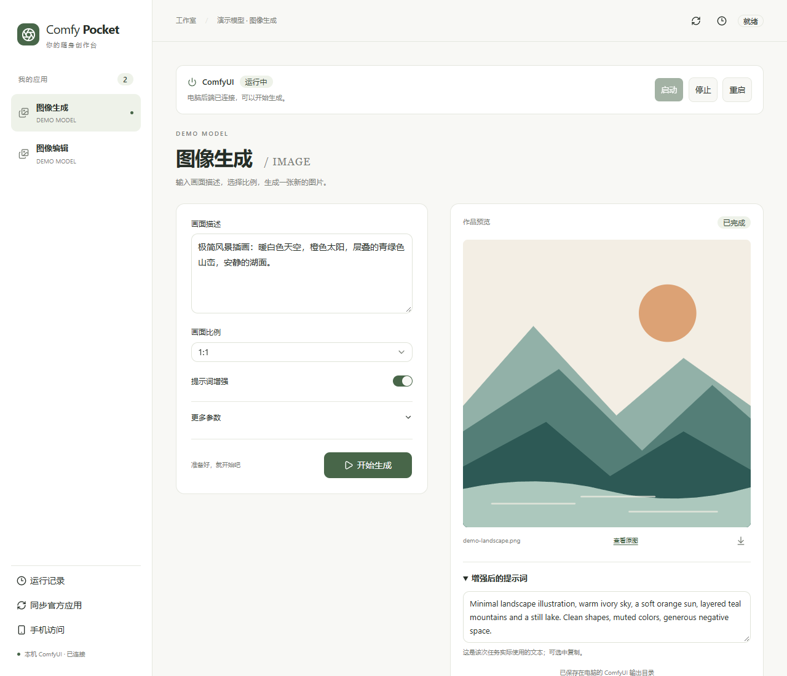
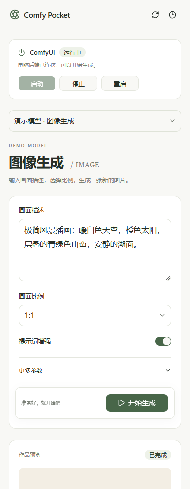
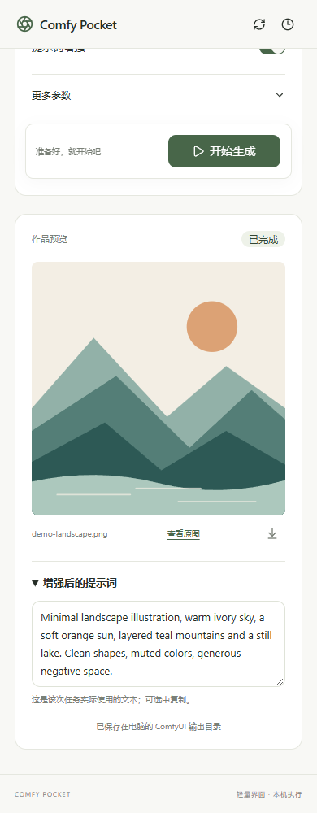

<div align="center">

<h1>Comfy Pocket</h1>

<p>A lightweight ComfyUI app client for your phone and desktop.</p>

[](https://www.npmjs.com/package/comfy-pocket)
[](https://github.com/SquirrelSong5/comfy-pocket/actions/workflows/checks.yml)
[](LICENSE)
[](https://nodejs.org/)
[](https://www.python.org/)

[简体中文](README.md) · English · [Quick start](#quick-start) · [User guide](docs/guide.en.md) · [Issues](https://github.com/SquirrelSong5/comfy-pocket/issues)

</div>

Comfy Pocket connects to your own ComfyUI and turns saved apps into forms for everyday use. Change prompts, upload images, follow progress, and download results from your phone or desktop.




## Why this project?

ComfyUI already has App Mode and supports mobile access. Pocket started with a practical problem: opening the official interface remotely over Tailscale on a phone involved a long wait, even when all that was needed was to change a prompt, upload an image, and check the result.

Pocket provides a separate, lightweight frontend focused on running apps, reducing the interface resources a phone needs to load. Apps are still built and saved in official ComfyUI, and jobs run on the same ComfyUI backend. This addresses page-loading overhead in that remote-use scenario, not model inference speed. Actual loading times still depend on the network and deployment.

## What does Pocket sync?

Pocket syncs apps you create and save using ComfyUI's **App Mode**.

An app uses an existing node workflow. In the official **App Builder**, you choose the inputs people should adjust—such as a prompt, reference image, or size—and the outputs they should see. ComfyUI presents those controls and results in a simple interface while the underlying workflow still does the work. See the [official App Mode guide](https://docs.comfy.org/interface/app-mode).

For example, a workflow with dozens of nodes might expose just a prompt, an aspect ratio, and the resulting image. The app's author decides what appears in the interface.

“Sync official apps” reads saved `.app.json` files and their input/output configuration from the connected ComfyUI instance, then builds Pocket's own controls. It does not automatically turn ordinary workflow `.json` files into apps. Build and save the app in ComfyUI first, then sync it in Pocket.

## Quick start

You need a working **ComfyUI** installation, **Node.js 22.12+**, and **Python 3.10+** with `venv` and `pip`.

```bash
npx comfy-pocket
```

Enter your ComfyUI directory or URL when prompted. The launcher opens your browser once setup finishes. On first use it installs an isolated Python environment; the frontend is already built.

1. Open a workflow in ComfyUI, enter App Mode, choose inputs and outputs in App Builder, and save the app (`.app.json`).
2. Click “同步官方应用” (Sync official apps) in Pocket.
3. Choose an app, set its inputs, and click “开始生成” (Generate).

Use the same command next time. Keep the terminal open; exiting Pocket does not stop ComfyUI.

<details>
<summary>Package not found on your npm mirror?</summary>

New packages can take time to reach mirrors. Use the official registry:

```bash
npx --registry=https://registry.npmjs.org/ comfy-pocket
```

</details>

For a specific Python environment, portable installations, or Windows double-click startup, see [installation](docs/guide.en.md#quick-start).

## Features

| | |
| --- | --- |
| **App sync** | Read saved official apps. Sync new apps without changing frontend code. |
| **Inputs and images** | Prompts, numbers, choices, switches, and uploads, including configured optional image groups. |
| **Live progress** | See the active node, execution steps, and queue status; cancel a job when needed. |
| **Results** | Smaller WebP previews with separate original downloads; text, video, and audio outputs. |
| **History** | Revisit jobs and results submitted through Pocket. |
| **Process controls** | Manually start and stop a configured local ComfyUI instance. Apps share one backend. |

Prompt enhancement and multi-image editing come from your workflow. Pocket reads its exposed inputs; it does not include models or edit node graphs.

## On your phone

<p align="center">
  
  &nbsp;&nbsp;
  
</p>

The desktop sidebar becomes an app picker on a phone, with results below the inputs. Choose an app, fill in the form, then scroll down to see the result. The clock button opens history.

Connect both devices to the same LAN or through Tailscale. Open “手机访问” (Phone access) on the computer to find the address and access code, then open that address in your phone's browser. Additional listening addresses need initial configuration; see [phone setup](docs/guide.en.md#phone-and-lan-access).

Jobs run on the computer, so switching away from the phone page does not interrupt generation. Keep the computer awake and Pocket running. Access is local-only by default; direct public port forwarding is not recommended.

<sub>Screenshots show the actual UI with public demo data and an SVG landscape illustration. Demo apps are not bundled. The interface currently uses Chinese labels.</sub>

## Documentation

- [Desktop and mobile walkthrough](docs/guide.en.md#a-look-around)
- [Configuration, CLI options, and upgrades](docs/guide.en.md#configuration-data-upgrades)
- [ComfyUI process management](docs/guide.en.md#process-management)
- [Compatibility, optional images, and prompt previews](docs/guide.en.md#compatibility)
- [Troubleshooting](docs/guide.en.md#troubleshooting) · [Security and privacy](docs/guide.en.md#security-and-privacy)

## Development and feedback

```bash
git clone https://github.com/SquirrelSong5/comfy-pocket.git
cd comfy-pocket
npm install
node cli/index.mjs
```

The frontend uses React, TypeScript, and shadcn/ui; the backend uses Python and aiohttp. See [development](docs/guide.en.md#development) for build and test commands.

[Open an issue](https://github.com/SquirrelSong5/comfy-pocket/issues) with reproduction steps and error messages. Remove personal images, access codes, and machine paths from app samples before sharing. Pull requests are welcome.

## License

[MIT](LICENSE). See [third-party notices](THIRD_PARTY_NOTICES.md) for dependencies. Comfy Pocket is an independent project and is not affiliated with ComfyUI.
